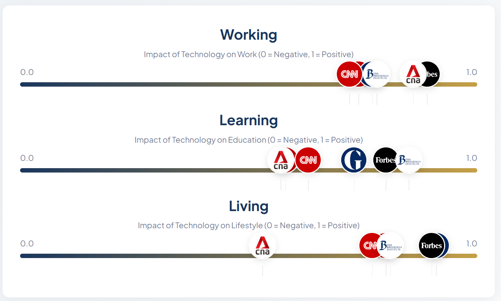

# MediaBias

## How to Run

1. **Run the Application**: Execute `python app.py` to ensure that the app is running.
2. **Install Live Server**: Install the [Live Server by Ritwick Dey](https://marketplace.visualstudio.com/items?itemName=ritwickdey.LiveServer) extension in VSCode.
3. **Open the HTML File**: Click "Go Live" at the bottom right hand corner of VSCode
You should be able to see the news agencies along different points of the scale. 
The file needs to be opened through the extension, otherwise the default scores will be 0.

## Data Collection

- **Methods**: Generative AI and a web scraper was used to retrieve articles that are relevant to the topics we are examining from different news agencies.

## Algorithm

- **Sentiment Analysis**: Utilizes RoBERTa for evaluating the overall sentiment of the articles published by the same news agency.

## Frontend

- **Visualization**: Data is formatted for clear visualization of the different biases across topics and agencies.

